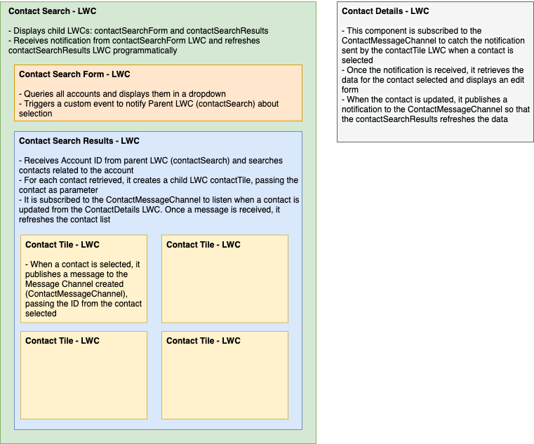

# Communication between Lightning Web Components

This example shows how you can share data between multiple LWCs through the use of Custom Events and Message Channel.

## LWC Communication: Design

- All project components are included in a Lightning App called Communication LWC, which is also contained in this package.
- The Lightning App page 'Communication LWC' contains the Lightning Web Components for this project.

Below is the structure and description for each of the Lightning Web Components:

## Documentation

- [Message Channel](https://developer.salesforce.com/docs/component-library/documentation/en/lwc/lwc.use_message_channel_intro)
- [Create and Dispatch Events](https://developer.salesforce.com/docs/component-library/documentation/en/lwc/lwc.events_create_dispatch)